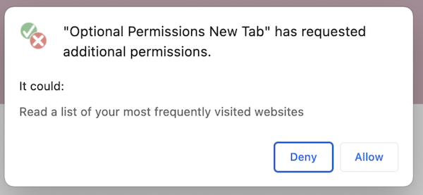

# Hybrid Permissions for Chrome Extensions

## TL;DR

Introduce “hybrid_permissions” that will be treated as regular permissions for new installs but behave like “optional_permissions” for existing users.

Extension manifest file example:

```json
{
  "name": "Permissions Extension",
  "hybrid_permissions": [
    "notifications"
  ]
}
```

## About this repository

It's an example of proposed "hybrid_permissions" property based on ["sample.optional_permissions"](https://github.com/GoogleChrome/chrome-extensions-samples/tree/main/functional-samples/sample.optional_permissions)

## Context

So far, there [are four kinds of permissions](https://developer.chrome.com/docs/extensions/develop/concepts/declare-permissions) allowed by Chrome manifest V3:
- permissions
- optional_permissions
- host_permissions
- optional_host_permissions

Two of these, “permissions” and ”host_permissions” are applied by default upon installation. The user reviews them and agrees during installation. If the developer adds a new permission, Chrome either applies it silently or disables the extension and shows a warning asking the user to agree to the changes in the list of permissions. [The UI for reapproval of such permission is very unclear](https://developer.chrome.com/docs/extensions/develop/concepts/permission-warnings), and in most cases, it means a loss of most active users.


On the other hand, "optional_permissions" is a list of permissions that should be explicitly requested in code during runtime. Users may agree to or decline each of these permissions separately.




## Problem statement

It’s not always possible to know the product's future state and predict all use cases in advance, especially when policies suggest only requesting permissions that matter.

In case the extension is already live, there is no good way to add a new mandatory permission. The permission with “warning” will silently “turn off” the extension, but “optional_permission” will lead to a suboptimal experience for new installs. In the case of a fresh install, users have to agree on permissions during the installation process and will immediately get a pop-up with a request for additional optional permission. 

It would be great to have a combined approach for existing and new installations.

## Proposal

Introduce “hybrid_permissions” that will be treated as regular permissions for new installs but behave like “optional_permissions” for existing users. 

Almost all optional permissions are qualified to be “hybrid” (Exceptions are the list of permissions that cannot be optional: debugger, declarativeNetRequest, devtools, geolocation, mdns, proxy, tts, ttsEngine, wallpaper.)

```json
{
  "name": "Permissions Extension",
  "hybrid_permissions": [
    "notifications"
  ]
}
```

In a nutshell, the hybrid permissions look and behave like “optional_permissions.” The only difference is that they are listed and agreed upon by the user during the installation flow.


## API reference for “hybrid_permissions”

[Existing “chrome.permissions” behavior](https://developer.chrome.com/docs/extensions/reference/api/permissions#step_3_request_optional_permissions) should be completely compatible with “hybrid” permissions. The only difference is that hybrid permissions should behave like permanent permissions and cannot be removed.


#### Declare hybrid permissions in the manifest.

```json
{
  "name": "My extension",
  // ...
  "permissions": [],
  "optional_permissions": [],
  "hybrid_permissions": ["tabs"],
  // ...
}
```

#### Check the extension's current permissions.

```js
chrome.permissions.contains({
  permissions: ['tabs'],
  origins: ['https://www.google.com/']
}, (result) => {
  if (result) {
    // The extension has the permissions.
  } else {
    // The extension doesn't have the permissions.
  }
});
```

#### Request hybrid permissions

```js
document.querySelector('#my-button').addEventListener('click', (event) => {
  // Permissions must be requested from inside a user gesture, like a button's
  // click handler.
  chrome.permissions.request({
    permissions: ['tabs'],
    origins: ['https://www.google.com/']
  }, (granted) => {
    // The callback argument will be true if the user granted the permissions.
    if (granted) {
      doSomething();
    } else {
      doSomethingElse();
    }
  });
});
```


#### Remove the permissions
The behavior should be the same as with “permanent” permissions. It should not be possible to remove it. “Chrome.permissions.remove” should return “false” and print an exception.

